# Credit_Risk_Analysis

## Purpose of the analysis 
The purpose of this analysis is to use different supervised machine learning methods to analyse and predict the measure of risk of loans issued by Lending Club.

## Results

* Naive Random Oversampling 
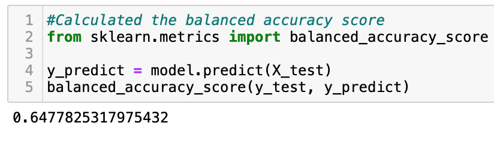
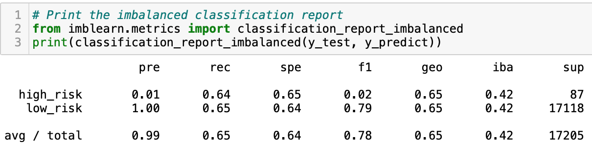

This model has an unimpressive measure of accuracy (64%) with majority of performance accuracy coming from the majority class as seen in the higher Pre, Rec and F1 scores for low risk loans.

* SMOTE Oversampling
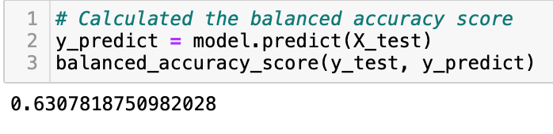
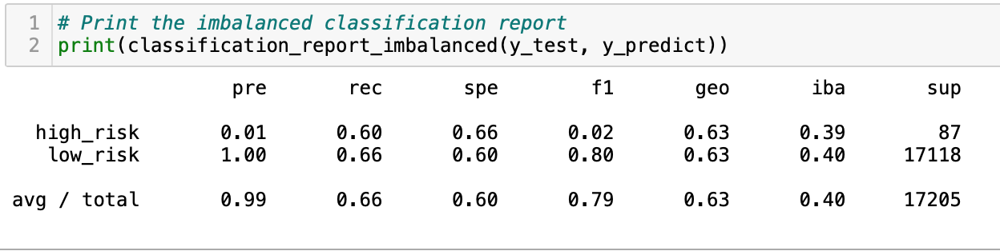

Being that this model uses values from the minority class to create synthetic new variables , this model performs similairly to the random oversampling model and has almost identical results for accuracy (63%) . These results may also indicate that there are not many outliers in the original dataset.

* Cluster Centroids Undersampling
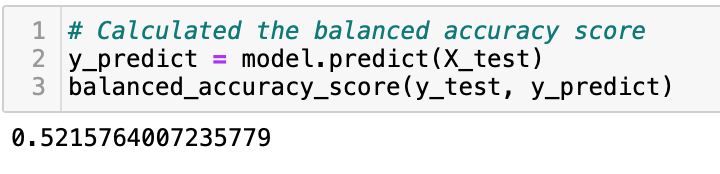
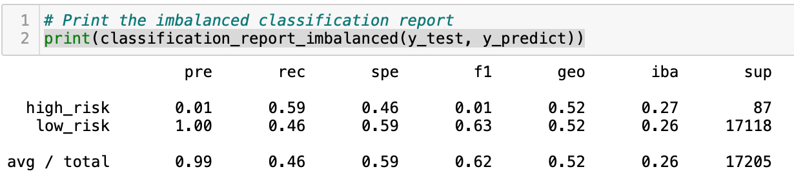

This model performed the worst of all testing models with an accuracy of 52%. While this model has a high precision score for the majority class it comes up short in the recall category with less than .5 probability . This test also has the lowest F1 score which is a summary of both precision and recall.

* SMOTEEN
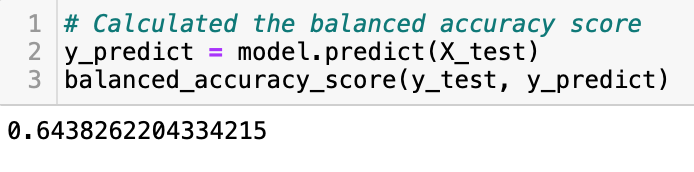
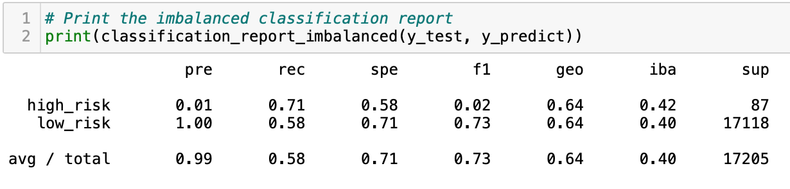
This model which combines both over and under sampling returned similar accuracy results(64%) to those observed by both oversampling models.The precision scores are consistently high for the the majority class and low for the minority class and similiar for the F1 scores. 

* Balanced Random Forest Classifier
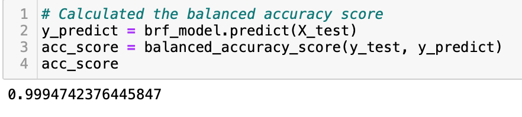
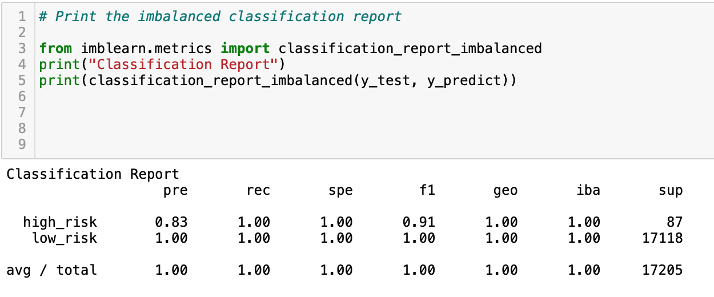

This model seeks to overcome the deficiencies of the other models by undersampling the value pool while the number of trees is fixed at 100 (n_estimators).
This model returns a balanced accuracy score of 99.9% with impressive metrics in precision , recall and F1 for both majority and minority classes. 

* Easy Ensemble AdaBoost 
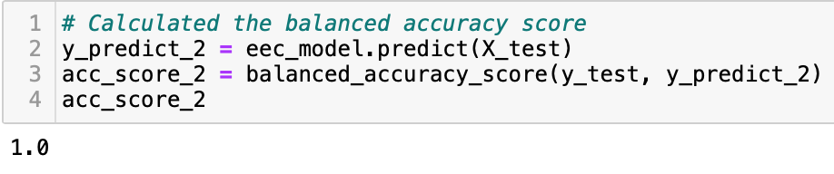
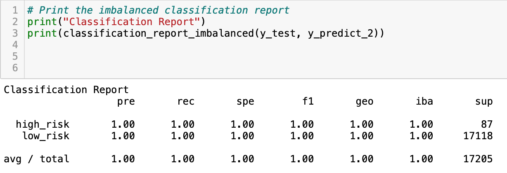
This model builds on other AdaBoooost models by effectively harnessing their learning capabilities and then performing random undersampling . This model achieves the overall highest score at 100% with full marks across all classification report metrics.

## Summary 
In summary the above models show that the initial size and balance of a dataset does contribute significantly to a models ability to predict outcomes . The wider the gap in classes , the more difficult it is to predict the target outcome, even when using stratification. 
In deciding a preferred method I would recommend using the Easy Ensemble Adaboost as it combines the most effective of tools  while using only actual data . 